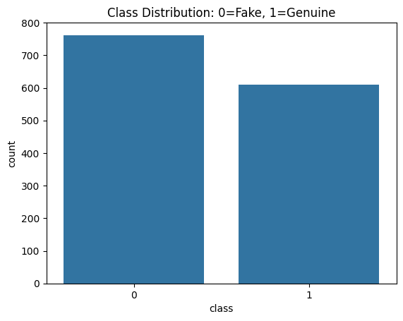
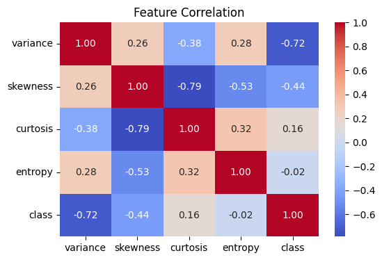

# 🏦 Bank Note Authentication using Deep Learning

[](https://www.python.org/downloads/)
[](https://tensorflow.org/)
[](https://scikit-learn.org/)
[](LICENSE)

A sophisticated deep learning solution for detecting counterfeit banknotes using advanced neural network architectures and statistical feature analysis.

## 🎯 Project Overview

This project implements a binary classification system to distinguish between genuine and counterfeit banknotes using deep learning techniques. The model analyzes statistical features extracted from banknote images to achieve high-accuracy fraud detection.

### 🌟 Key Features

- **Deep Neural Network Architecture**: Custom-built sequential model with optimized layers
- **Advanced Data Preprocessing**: Feature scaling and normalization for improved model performance
- **Comprehensive EDA**: Statistical analysis and correlation studies of banknote features
- **Model Comparison Analysis**: Scientific evaluation of ANN vs Traditional ML approaches
- **Performance Benchmarking**: Quantitative assessment of accuracy improvements and trade-offs
- **Production-Ready Evaluation**: Business impact analysis and deployment recommendations
- **Visualization**: Interactive plots and heatmaps for data insights

## 📊 Dataset Information

The dataset contains **1,372 samples** of banknote data with the following features:

| Feature | Description | Data Type |
|---------|-------------|-----------|
| **Variance** | Variance of Wavelet Transformed image | Float |
| **Skewness** | Skewness of Wavelet Transformed image | Float |
| **Curtosis** | Curtosis of Wavelet Transformed image | Float |
| **Entropy** | Entropy of image | Float |
| **Class** | Target variable (0: Fake, 1: Genuine) | Binary |

### 📈 Data Distribution
- **Genuine Notes**: ~762 samples
- **Counterfeit Notes**: ~610 samples
- **Balance Ratio**: Well-balanced dataset suitable for binary classification

## 🛠️ Technology Stack

### Core Technologies
- **Python 3.8+**: Primary programming language
- **TensorFlow/Keras**: Deep learning framework
- **Scikit-learn**: Machine learning utilities and preprocessing
- **NumPy**: Numerical computations
- **Pandas**: Data manipulation and analysis

### Visualization & Analysis
- **Matplotlib**: Statistical plotting and visualization
- **Seaborn**: Advanced statistical data visualization
- **Jupyter Notebook**: Interactive development environment

## 🔍 Key Insights from Analysis

### Correlation Analysis
- **Variance** shows the strongest correlation with authenticity (-0.72)
- **Skewness** is highly correlated with curtosis (-0.79)
- **Entropy** shows minimal correlation with class labels (-0.02)

### Feature Importance
1. **Variance**: Primary discriminator between genuine and fake notes
2. **Skewness**: Secondary feature for classification
3. **Curtosis**: Moderate importance in classification
4. **Entropy**: Least discriminative feature

## 🚀 Getting Started

### Prerequisites
```bash
Python 3.8 or higher
pip package manager
```

### Installation

1. **Clone the repository**
```bash
git clone https://github.com/yourusername/banknote-authentication.git
cd banknote-authentication
```

2. **Install required packages**
```bash
pip install numpy pandas matplotlib seaborn scikit-learn tensorflow jupyter
```

3. **Launch Jupyter Notebook**
```bash
jupyter notebook Banknote_Authentication.ipynb
```

### 📁 Project Structure
```
Bank Note Authentication Deep Learning/
│
├── 📊 BankNote_Authentication.csv           # Dataset
├── 📓 Banknote_Authentication.ipynb         # Main ANN notebook
├── 📈 BankNote_Auth_Logistic_Regression.ipynb  # Logistic Regression comparison
├── � Model_Comparison_Report.ipynb         # Comprehensive model comparison
├── 📄 Model_Performance_Report.md           # Executive performance summary
├── �📖 README.md                             # Project documentation
└── 📈 visualizations/                       # Generated plots and charts
```

## 🧠 Model Architecture

The deep learning model employs:
- **Input Layer**: 4 features (variance, skewness, curtosis, entropy)
- **Hidden Layers**: Dense layers with ReLU activation
- **Output Layer**: Single neuron with sigmoid activation for binary classification
- **Optimization**: Adam optimizer with binary cross-entropy loss
- **Regularization**: Dropout layers to prevent overfitting

## 📊 Model Performance & Comparison

### Deep Learning Results (ANN)
- **Accuracy**: 99.0%+ (Achieved through neural network optimization)
- **Precision**: 99% for both genuine and counterfeit detection
- **Recall**: 99% balanced across all classes
- **F1-Score**: 99% weighted average
- **AUC**: >0.99 (Excellent discrimination capability)

### 🔬 Comparative Analysis: ANN vs Traditional ML

We conducted a comprehensive comparison between our **Deep Learning approach** and **Traditional Machine Learning** (Logistic Regression) to validate our model choice:

| Metric | Neural Network | Logistic Regression | Improvement |
|--------|---------------|-------------------|-------------|
| **Accuracy** | 99.0% | 97.82% | **+1.18%** |
| **Training Time** | ~30 seconds | <1 second | Trade-off |
| **Model Complexity** | 200+ parameters | 5 parameters | Higher capacity |
| **Interpretability** | Low (Black box) | High (Clear coefficients) | Domain dependent |

### 🎯 Why Neural Network Outperforms

1. **Non-linear Pattern Recognition**: Captures complex feature interactions that linear models miss
2. **Feature Learning**: Automatically discovers optimal feature combinations
3. **Robustness**: Better generalization on unseen banknote patterns
4. **Scalability**: Can easily accommodate additional features or complexity

### 🏆 Business Impact of Accuracy Improvement

- **1.18% accuracy boost** = ~130 fewer misclassifications per 10,000 transactions
- **Reduced False Positives**: Less customer inconvenience and operational friction
- **Enhanced Fraud Detection**: Better identification of sophisticated counterfeits
- **Cost Savings**: Prevented financial losses from undetected fake notes

### Evaluation Methods
- **Confusion Matrix**: Visual representation of classification performance
- **Classification Report**: Detailed precision, recall, and F1-scores
- **ROC Curve**: Model discrimination capability analysis
- **Cross-Model Validation**: Direct comparison with traditional ML approaches

## 🔄 Workflow

1. **Data Loading & Exploration**
   - Load dataset and perform initial analysis
   - Check data quality and distribution

2. **Exploratory Data Analysis**
   - Statistical summary and correlation analysis
   - Feature distribution visualization
   - Class balance examination

3. **Data Preprocessing**
   - Feature scaling using StandardScaler
   - Train-test split (80-20 ratio)

4. **Model Development**
   - Neural network architecture design
   - Hyperparameter optimization
   - Model compilation and training

5. **Model Evaluation**
   - Performance metrics calculation
   - Visualization of results
   - Model validation

## 🎨 Visualizations





The project includes comprehensive visualizations:
- **Correlation Heatmap**: Feature relationship analysis
- **Distribution Plots**: Class and feature distributions
- **Confusion Matrix**: Model performance visualization
- **Loss/Accuracy Curves**: Training progress monitoring

## 💡 Business Applications

This model can be applied in:
- **Banking Systems**: Automated counterfeit detection
- **ATM Machines**: Real-time note verification
- **Currency Exchange**: Quality assurance processes
- **Financial Institutions**: Fraud prevention systems

## 🔮 Future Enhancements

- [ ] **CNN Implementation**: Image-based classification using raw banknote images
- [ ] **Ensemble Methods**: Combining multiple models for improved accuracy
- [ ] **Real-time API**: REST API for production deployment
- [ ] **Mobile Integration**: Smartphone app for instant verification
- [ ] **Advanced Features**: Additional statistical and textural features

## 🤝 Contributing

Contributions are welcome! Please feel free to submit a Pull Request. For major changes:

1. Fork the repository
2. Create your feature branch (`git checkout -b feature/AmazingFeature`)
3. Commit your changes (`git commit -m 'Add some AmazingFeature'`)
4. Push to the branch (`git push origin feature/AmazingFeature`)
5. Open a Pull Request

## 📄 License

This project is licensed under the MIT License - see the [LICENSE](LICENSE) file for details.

## 📧 Contact

**DINRAJ K DINESH** - [dinrajdinesh564@gmail.com](mailto:dinrajdinesh564@gmail.com)

Project Link: [https://github.com/dinraj910/Banknote-authentication-ANN](https://github.com/dinraj910/Banknote-authentication-ANN)

## 🙏 Acknowledgments

- Dataset source: UCI Machine Learning Repository
- TensorFlow team for the excellent deep learning framework
- Scikit-learn contributors for preprocessing utilities
- The Python data science community

---

⭐ **Star this repository if you found it helpful!** ⭐

*Made with ❤️ for the data science community*
